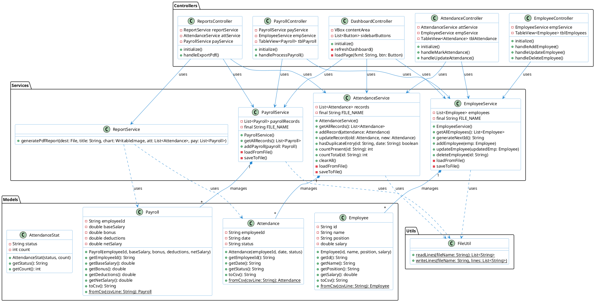
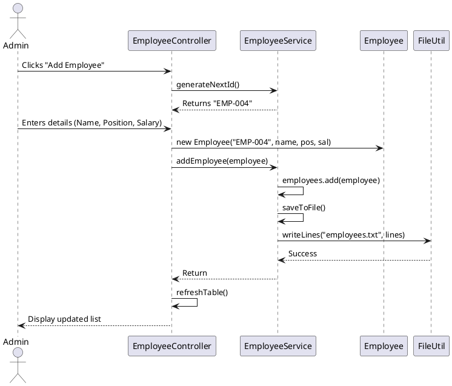
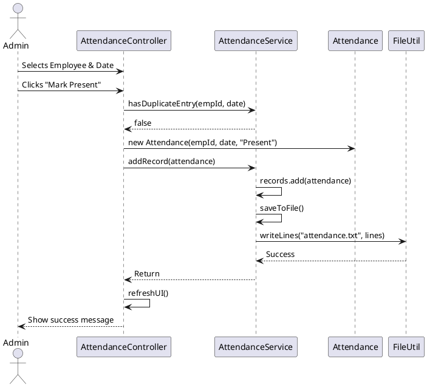
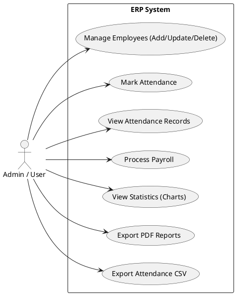
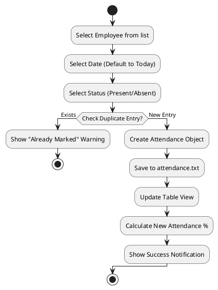

# ERP System Class Diagram

This document contains the professional UML Class Diagram for the Employee Management and Attendance Tracking ERP System.

## PlantUML Code

<<<<<<< HEAD

## 🔄 Sequence Diagram: Add Employee
This diagram shows the interaction between the UI, Controller, Service, and File system when a new employee is added.

## 🔄 Sequence Diagram: Mark Attendance
This diagram shows the process of recording attendance, including the duplicate check.

## 🎯 Use Case Diagram
Describes the high-level functionality available to the system users.

## ⚡ Activity Diagram: Mark Attendance Process
Shows the logical flow of the "Mark Attendance" use case.

## Description
These diagrams provide a comprehensive overview of the system:
1.  **Class Diagram**: Static structure and relationships.
2.  **Sequence Diagrams**: Dynamic interaction for core business flows.
3.  **Use Case Diagram**: High-level functional requirements.
4.  **Activity Diagram**: Detailed logic flow for complex operations.
=======

>>>>>>> 2068560250b17581347720c4b482b459e29db304
