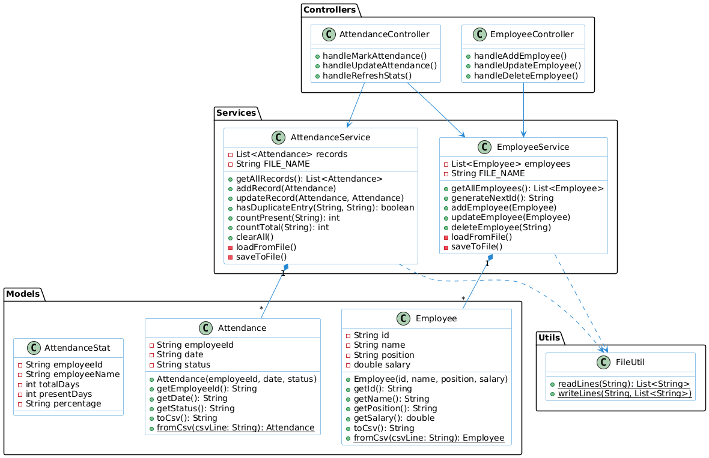

# ERP System

A lightweight, object-oriented Enterprise Resource Planning (ERP) desktop application built with Java, JavaFX, and File-based Data Persistence. This application is designed to manage Employees, track Daily Attendance, and process Payroll cleanly and efficiently.

##  Project Overview

This project was developed with a strong emphasis on **Clean Code**, **Object-Oriented Programming (OOP) principles**, and **Separation of Concerns**. Instead of relying on a heavy database (like MySQL or SQLite), this application uses custom file-based persistence (reading and writing to `.txt` files) to demonstrate an understanding of core Java I/O and data manipulation.

---

##  Key Features

1. **Interactive Dashboard**: Displays real-time Key Performance Indicators (KPIs), activity summaries, and recent events (like the latest payroll processed or employee added).
2. **Employee Management**: Add, update, delete, and search employee records. IDs are auto-generated to ensure uniqueness.
3. **Attendance Tracking**: 
   - Log daily "Present" or "Absent" status.
   - Prevents duplicate entries for the same employee on the same day.
   - Calculates and color-codes attendance percentages per employee dynamically.
   - Allows exporting attendance logs directly to a `.csv` file.
4. **Payroll Processing**: 
   - Calculates net salary based on base pay, overtime, bonuses, deductions, and tax rate.
   - Generates a detailed itemized salary breakdown.
5. **Reports & Analytics**:
   - Visualizes live data using interactive JavaFX Pie and Bar Charts.
   - Generates professional, downloadable PDF reports summarizing Attendance and Payroll statistics utilizing the **Apache PDFBox** library.
6. **Modern UI/UX**: Features a fully custom CSS design system with a seamless Light/Dark mode toggle that instantly transforms the entire application.

---

## Architecture & Project Structure (MVC Pattern)

This project strictly follows a modified **Model-View-Controller (MVC)** architectural pattern, expanded with a **Service Layer**. This makes the code highly modular, easy to read, and easy to maintain.

### 1. Models (`/models`)
**What they do:** These are simple Plain Old Java Objects (POJOs) that represent real-world entities. 
**Examples:** `Employee.java`, `Attendance.java`, `Payroll.java`.
**Role:** They contain only private data fields (like `id`, `name`, `salary`), Constructors, Getters, and Setters. They have *no* business logic and do not know about the UI.

### 2. Views (`/resources/fxml` and `/resources/styles`)
**What they do:** Define what the user sees on the screen.
**Examples:** `dashboard.fxml`, `main.css`, `dark.css`.
**Role:** The FXML files act as the layout backbone. The CSS files utilize CSS variables (tokens) to manage styling and theme switching cleanly.

### 3. Controllers (`/controllers`)
**What they do:** The "middlemen" between the User Interface (View) and the Business Logic (Service).
**Examples:** `EmployeeController.java`, `PayrollController.java`.
**Role:** 
- They respond to user actions (e.g., button clicks, typing in a text field).
- They read input from the UI and pass it to the Service layer.
- They take data from the Service layer and display it on the UI (e.g., populating a `TableView`).
- **Important:** Controllers *do not* save data to files or perform complex math. They only control the flow of data.

### 4. Services (`/services`)
**What they do:** The "brain" of the application where the core Business Logic and Data Persistence happen.
**Examples:** `EmployeeService.java`, `AttendanceService.java`, `ReportService.java`.
**Role:**
- They handle the actual data lists (e.g., `List<Employee>`).
- They enforce business rules (e.g., "Check if an attendance log already exists today before saving").
- They abstract complex library operations (e.g., `ReportService` handles the heavy lifting of drawing lines and text onto a PDF document using Apache PDFBox).
- They are responsible for communicating with the File System (saving to and loading from text files).

### 5. Utilities (`/utils`)
**What they do:** Shared helper functions.
**Examples:** `FileUtil.java`.
**Role:** Keeps repetitive code out of the services (e.g., the exact `try-catch` blocks needed to read/write lines of text to a file).

---

##  Discussion Guide: "Why separate Controllers and Services?"

During a code review, your professor may ask: *"Why didn't you just write the file-saving code inside the button click event in the Controller?"*

Here is the professional explanation:

1. **Single Responsibility Principle (SRP):** A core rule of OOP. A class should have only one job. The Controller's job is to manage the UI elements (Text Fields, Buttons). The Service's job is to manage the data. If we mix them, the Controller becomes a massive, unreadable "God Object."
2. **Reusability:** By putting data logic in `EmployeeService`, *any* part of the app can access employee data. For example, both `EmployeeController` and `AttendanceController` need a list of employees. Because it's in a Service, they can both easily create an `EmployeeService` object and request the data.
3. **Testability & Maintenance:** If there is a bug with how data is saved to the file, we know immediately to check the `Service` or `FileUtil` layer, rather than digging through hundreds of lines of UI event handlers in the `Controller`.

---

##  File-Based Persistence

To keep the application lightweight and demonstrate Java file I/O streams, data is stored in simple `.txt` files in a Comma-Separated Values (CSV) format.

* `employees.txt`: Stores `ID,Name,Position,Salary`
* `attendance.txt`: Stores `EmployeeID,Date,Status`
* `payroll.txt`: Stores `EmployeeID,Base,Bonus,Deductions,Net`

When the application starts, the Services read these text files, parse the lines back into Java Objects (Models), and load them into memory. When a user adds or edits data, the Service updates the objects in memory and overwrites the text file to save the changes permanently.

